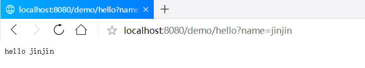
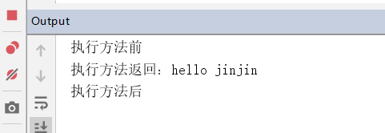

# 项目目的

在理解 Spring 系统结构、实现原理的基础上，自己动手写一个实现Spring核心功能的框架，以达到学习的目的。

# 项目入口

项目的入口为DispatcherSerlvet的init()方法中，在Servlet 的 init 方法初始化了IOC容器和Spring MVC所依赖的组件

# 项目搭建

## 用户配置

### application.properties配置

application.properties作为配置文件，配置所需要的属性，配置如下：

```properties
scanPackage=top.jinjinz.spring
```

### web.xml 配置

配置自定义Servlet `DispatcherServlet`及设置匹配请求

```xml
<?xml version="1.0" encoding="UTF-8"?>
<web-app xmlns:xsi="http://www.w3.org/2001/XMLSchema-instance"
	xmlns="http://java.sun.com/xml/ns/j2ee" xmlns:javaee="http://java.sun.com/xml/ns/javaee"
	xmlns:web="http://java.sun.com/xml/ns/javaee/web-app_2_5.xsd"
	xsi:schemaLocation="http://java.sun.com/xml/ns/j2ee http://java.sun.com/xml/ns/j2ee/web-app_2_4.xsd"
	version="2.4">
	<display-name>Web Application</display-name>
	<servlet>
		<servlet-name>mvc</servlet-name>
		<servlet-class>top.jinjinz.spring.web.servlet.DispatcherServlet</servlet-class>
		<load-on-startup>1</load-on-startup>
	</servlet>
	<servlet-mapping>
		<servlet-name>mvc</servlet-name>
		<url-pattern>/*</url-pattern>
	</servlet-mapping>
</web-app>
```

## 项目配置

### build.gradle配置

build.gradle配置相关的jar包依赖，目前只依赖了servlet api。

```groovy
subprojects {
    apply plugin: 'java'

    group 'spring-demo'


    repositories {
        mavenCentral()
    }

    dependencies {
        compile group: 'javax.servlet', name: 'javax.servlet-api', version: '3.1.0'
    }
}
```

### 项目模块

| 项目名        | 项目描述             |
| ------------- | -------------------- |
| spring-core   | IOC容器/依赖注入     |
| spring-webmvc | web框架，基于Servlet |
| spring-aop    | AOP框架              |
| spring-test   | 测试项目             |

# 项目设计

## spring-aop

实现切面功能，判断加上注解的类注册切面方法。

### 注解定义

定义aop相关注解`@After`、`@Aspect`、`@Before`

```java
@Retention(RetentionPolicy.RUNTIME)
@Target(ElementType.METHOD)
public @interface After {

    String value();

    String argNames() default "";
}
```

```java
@Retention(RetentionPolicy.RUNTIME)
@Target(ElementType.TYPE)
public @interface Aspect {
    public String value() default "";
}
```

```java
@Retention(RetentionPolicy.RUNTIME)
@Target(ElementType.METHOD)
public @interface Before {

    String value();

    String argNames() default "";

}
```

### 接口定义

#### Advice

```java
package top.jinjinz.spring.aop;

/**
 * Advice标签接口
 * @author jinjin
 * @date 2019-04-22
 */
public interface Advice {
}
```

#### AopProxy

```java
package top.jinjinz.spring.aop;

/**
 * AOP代理的接口
 * @author jinjin
 * @date 2019-04-18
 */
public interface AopProxy {

    Object getProxy();

    Object getProxy(ClassLoader classLoader);
}
```

#### Joinpoint

```java
package top.jinjinz.spring.aop.intercept;


/**
 * 连接点
 * @author jinjin
 * @date 2019-04-18
 */
public interface Joinpoint {

    Object proceed() throws Throwable;

    Object getThis();
}
```

#### MethodInterceptor

```java
package top.jinjinz.spring.aop.intercept;

/**
 * 方法调用过程中调用
 * @author jinjin
 * @date 2019-04-18
 */
public interface MethodInterceptor {
    Object invoke(MethodInvocation invocation) throws Throwable;
}
```

#### MethodInvocation

```java
package top.jinjinz.spring.aop.intercept;

import java.lang.reflect.Method;

/**
 * 方法拦截
 * @author jinjin
 * @date 2019-04-18
 */
public interface MethodInvocation extends Joinpoint{

    Method getMethod();

    Object[] getArguments();
}
```

### 功能实现

#### AdvisedSupport

保存类方法执行时关联的调用链

```java
package top.jinjinz.spring.aop;

import java.lang.reflect.Method;
import java.util.List;
import java.util.Map;
import java.util.regex.Pattern;

/**
 * AOP代理配置管理器的基类
 * @author jinjin
 * @date 2019-04-18
 */
public class AdvisedSupport {

    private Class<?> targetClass;

    private Object target;

    private Pattern pointCutClassPattern;

    /** 缓存方法为键，调用链列表为值 */
    private transient Map<Method, List<Object>> methodCache;

    public List<Object> getInterceptorsAndDynamicInterceptionAdvice(
        Method method,Class<?> targetClass)
            throws Exception {
        List<Object> cached = this.methodCache.get(method);
        if (cached == null) {
            Method m =
                targetClass.getMethod(method.getName(),method.getParameterTypes());
            cached = methodCache.get(m);
            this.methodCache.put(method, cached);
        }
        return cached;
    }

    public Class<?> getTargetClass() {
        return targetClass;
    }

    public void setTargetClass(Class<?> targetClass) {
        this.targetClass = targetClass;
    }

    public Object getTarget() {
        return target;
    }

    public void setTarget(Object target) {
        this.target = target;
    }

    public Pattern getPointCutClassPattern() {
        return pointCutClassPattern;
    }

    public void setPointCutClassPattern(Pattern pointCutClassPattern) {
        this.pointCutClassPattern = pointCutClassPattern;
    }

    public Map<Method, List<Object>> getMethodCache() {
        return methodCache;
    }

    public void setMethodCache(Map<Method, List<Object>> methodCache) {
        this.methodCache = methodCache;
    }
}
```

#### JdkDynamicAopProxy

使用jdk动态代理，执行方法时，执行方法调用链

```java
package top.jinjinz.spring.aop;

import top.jinjinz.spring.aop.intercept.MethodInvocation;

import java.lang.reflect.InvocationHandler;
import java.lang.reflect.Method;
import java.lang.reflect.Proxy;
import java.util.List;

/**
 * JDK动态代理实现{@link AopProxy}
 * @author jinjin
 * @date 2019-04-18
 */
public class JdkDynamicAopProxy implements AopProxy, InvocationHandler {

    private final AdvisedSupport advised;

    public JdkDynamicAopProxy(AdvisedSupport config) throws Exception {
        this.advised = config;
    }

    @Override
    public Object getProxy() {
        return getProxy(this.advised.getTargetClass().getClassLoader());
    }

    @Override
    public Object getProxy(ClassLoader classLoader) {
        return Proxy.newProxyInstance(
            classLoader,this.advised.getTargetClass().getInterfaces(),this);
    }

    @Override
    public Object invoke(Object proxy, Method method, Object[] args) 
        throws Throwable {
        List<Object> chain = this.advised.getInterceptorsAndDynamicInterceptionAdvice(
             method,this.advised.getTargetClass());
        //如果没有可以应用到此方法的通知(Interceptor)，直接反射调用
        if(null==chain){
            return method.invoke(proxy, args);
        }
        MethodInvocation invocation = new ReflectiveMethodInvocation(
            proxy,advised.getTarget(),method,args,this.advised.getTargetClass(),chain);
        return invocation.proceed();
    }
}
```

#### ProxyFactory

生成代理对象

```java
package top.jinjinz.spring.aop;

import java.lang.reflect.Proxy;

/**
 * 用于AOP代理的工厂，用于编程使用，而不是通过声明性
 * @author jinjin
 * @date 2019-04-18
 */
public class ProxyFactory extends AdvisedSupport{


    public Object getProxy() throws Exception {
        return createAopProxy().getProxy();
    }

    public Object getProxy(ClassLoader classLoader)  throws Exception{
        return createAopProxy().getProxy(classLoader);
    }

    private synchronized AopProxy createAopProxy() throws Exception{
            Class<?> targetClass = getTargetClass();
            if (targetClass == null) {
                throw new Exception("没有代理目标类");
            }
            if (targetClass.isInterface() || Proxy.isProxyClass(targetClass)) {
                return new JdkDynamicAopProxy(this);
            }
            //todo 没有继承接口的类需要cglib代理
            //return new ObjenesisCglibAopProxy(config);
            return new JdkDynamicAopProxy(this);
    }


}
```

#### ReflectiveMethodInvocation

执行方法调用链

```java
package top.jinjinz.spring.aop;

import top.jinjinz.spring.aop.intercept.MethodInterceptor;
import top.jinjinz.spring.aop.intercept.MethodInvocation;

import java.lang.reflect.Method;
import java.util.List;
import java.util.Map;

/**
 * aop实现类
 * @author jinjin
 * @date 2019-04-18
 */
public class ReflectiveMethodInvocation implements MethodInvocation {

    protected final Object proxy;

    protected final Object target;

    protected final Method method;

    protected Object[] arguments = new Object[0];

    private final Class<?> targetClass;

    private Map<String, Object> userAttributes;

    protected final List<?> interceptorsAndDynamicMethodMatchers;

    //定义一个索引，从-1开始来记录当前拦截器执行的位置
    private int currentInterceptorIndex = -1;

    public ReflectiveMethodInvocation(
        Object proxy,Object target, Method method,Object[] arguments,
        Class<?> targetClass, List<Object> interceptorsAndDynamicMethodMatchers) {

        this.proxy = proxy;
        this.target = target;
        this.targetClass = targetClass;
        this.method = method;
        this.arguments = arguments;
        this.interceptorsAndDynamicMethodMatchers = interceptorsAndDynamicMethodMatchers;
    }

    @Override
    public Method getMethod() {
        return this.method;
    }

    @Override
    public Object[] getArguments() {
        return this.arguments;
    }

    @Override
    public Object proceed() throws Throwable {
        //如果Interceptor执行完了，则执行joinPoint
        if (this.currentInterceptorIndex ==
            this.interceptorsAndDynamicMethodMatchers.size() - 1) {
            return this.method.invoke(this.target,this.arguments);
        }
        Object interceptorOrInterceptionAdvice =
             this.interceptorsAndDynamicMethodMatchers.get(
            ++this.currentInterceptorIndex);
        //动态匹配joinPoint
        if (interceptorOrInterceptionAdvice instanceof MethodInterceptor) {
            MethodInterceptor mi = (MethodInterceptor) interceptorOrInterceptionAdvice;
            return mi.invoke(this);
        } else {
            //动态匹配失败时,略过当前Intercetpor,调用下一个Interceptor
            return proceed();
        }
    }

    @Override
    public Object getThis() {
        return this.target;
    }
}
```

#### AutoProxyCreator

实现BeanPostProcessor接口，在初始化bean时调用，此时创建代理对象并加入调用方法链

```java
package top.jinjinz.spring.aop.autoproxy;

import top.jinjinz.spring.aop.AdvisedSupport;
import top.jinjinz.spring.aop.ProxyFactory;
import top.jinjinz.spring.aop.adapter.AfterReturningAdviceInterceptor;
import top.jinjinz.spring.aop.adapter.MethodBeforeAdviceInterceptor;
import top.jinjinz.spring.aop.annotation.After;
import top.jinjinz.spring.aop.annotation.AfterThrowing;
import top.jinjinz.spring.aop.annotation.AopProxyUtils;
import top.jinjinz.spring.aop.annotation.Before;
import top.jinjinz.spring.aop.aspectj.AspectJAdvice;
import top.jinjinz.spring.beans.factory.BeanFactory;
import top.jinjinz.spring.beans.factory.config.BeanPostProcessor;

import java.lang.annotation.Annotation;
import java.lang.reflect.Method;
import java.util.ArrayList;
import java.util.HashMap;
import java.util.List;
import java.util.Map;
import java.util.regex.Matcher;
import java.util.regex.Pattern;

/**
 * 自动创建代理
 * @author jinjin
 * @date 2019-04-18
 */
public class AutoProxyCreator implements BeanPostProcessor {

    private final Map<String,List<AspectJAdvice>> aspectMethods;

    private final List<String> patterns;

    public AutoProxyCreator(Map<String, List<AspectJAdvice>> aspectMethods,
                            List<String> patterns) {
        this.aspectMethods = aspectMethods;
        this.patterns = patterns;
    }

    @Override
    public Object postProcessBeforeInitialization(Object bean, String beanName,
                                                  BeanFactory beanFactory)
            throws Exception {
        if (bean != null) {
            ProxyFactory proxyFactory = new ProxyFactory();
            proxyFactory.setTarget(bean);
            proxyFactory.setTargetClass(bean.getClass());
            proxyFactory.setMethodCache(
                getMethodCathe(proxyFactory,beanFactory,Before.class));
            return proxyFactory.getProxy();
        }
        return bean;
    }

    @Override
    public Object postProcessAfterInitialization(Object bean, String beanName,
                                                 BeanFactory beanFactory)
            throws Exception {
        if (bean != null) {
            ProxyFactory proxyFactory = new ProxyFactory();
            proxyFactory.setTarget(bean);
            proxyFactory.setTargetClass(bean.getClass());
            proxyFactory.setMethodCache(
                getMethodCathe(proxyFactory,beanFactory,After.class));
            return proxyFactory.getProxy();
        }
        return bean;
    }

    private List<Object> getAdvices(
        String p,BeanFactory beanFactory,Class<? extends Annotation> annotationClass)
        throws Exception{
        List<Object> advices = new ArrayList<>();
        List<AspectJAdvice> aspectJAdviceList = aspectMethods.get(p);
        for (AspectJAdvice aspectJAdvice:aspectJAdviceList) {
            //注入
            if(aspectJAdvice.getAspectTarget() instanceof String){
                aspectJAdvice.setAspectTarget(
                    beanFactory.getBean((String)aspectJAdvice.getAspectTarget()));
            } 
            if(aspectJAdvice.getAspectMethod().isAnnotationPresent(Before.class)){
                advices.add(new MethodBeforeAdviceInterceptor(aspectJAdvice));
            }else if(aspectJAdvice.getAspectMethod().isAnnotationPresent(After.class)){
                advices.add(new AfterReturningAdviceInterceptor(aspectJAdvice));
             }
        }
        return advices;
    }

    private Map<Method, List<Object>> getMethodCathe(
        AdvisedSupport advisedSupport,BeanFactory beanFactory,
        Class<? extends Annotation> annotationClass) throws Exception{
        Map<Method, List<Object>> methodCache = new HashMap<>();
        Method[] methods=advisedSupport.getTargetClass().getMethods();
        List<Object> advices;
        Matcher matcher;
        String methodString;
        Pattern pattern;
        for (Method method:methods) {
            methodString = method.toString();
            if(methodString.contains("throws")){
                methodString = 
                    methodString.substring(0,methodString.lastIndexOf("throws")).trim();
            }
            //判断所有的Aspect中的方法上的正则查看是否匹配
            for (String p:patterns){
                pattern = Pattern.compile(p);
                matcher = pattern.matcher(methodString);
                if(matcher.matches()){
                    advices = getAdvices(p,beanFactory,annotationClass);
                    methodCache.put(method,advices);
                    break;
                }
            }
        }
        return methodCache;
    }

}
```

#### AspectJAdvice

保存配置需要切面执行的方法及方法的类

```java
package top.jinjinz.spring.aop.aspectj;

import java.lang.reflect.Method;

/**
 * 执行属性
 * @author jinjin
 * @date 2019-04-22
 */
public class AspectJAdvice {
    private Method aspectMethod;
    private Object aspectTarget;

    public AspectJAdvice(Method aspectMethod, Object aspectTarget) {
        this.aspectMethod = aspectMethod;
        this.aspectTarget = aspectTarget;
    }

    public Method getAspectMethod() {
        return aspectMethod;
    }

    public void setAspectMethod(Method aspectMethod) {
        this.aspectMethod = aspectMethod;
    }

    public Object getAspectTarget() {
        return aspectTarget;
    }

    public void setAspectTarget(Object aspectTarget) {
        this.aspectTarget = aspectTarget;
    }
}
```

#### AbstractAspectJAdvice

Advice的抽象类，定义基本功能，执行配置的切面方法

```java
package top.jinjinz.spring.aop.aspectj;

import top.jinjinz.spring.aop.Advice;
import top.jinjinz.spring.aop.annotation.AopProxyUtils;
import top.jinjinz.spring.aop.intercept.Joinpoint;

import java.lang.reflect.Method;
import java.lang.reflect.Proxy;

/**
 * 基类  {@link top.jinjinz.spring.aop.Advice}
 * @author jinjin
 * @date 2019-04-22
 */
public abstract class AbstractAspectJAdvice implements Advice {

    private AspectJAdvice aspectJAdvice;

    public AbstractAspectJAdvice(AspectJAdvice aspectJAdvice) {
        this.aspectJAdvice = aspectJAdvice;
    }

    protected Object invokeAdviceMethod(Joinpoint joinPoint, Object returnValue,
                                        Throwable tx) throws Throwable{
        Class<?> [] paramTypes = 
            this.aspectJAdvice.getAspectMethod().getParameterTypes();
        if(paramTypes.length == 0){
            return this.aspectJAdvice.getAspectMethod().invoke(
                aspectJAdvice.getAspectTarget());
        }else{
            Object [] args = new Object[paramTypes.length];
            for (int i = 0; i < paramTypes.length; i ++) {
                if(paramTypes[i] == Throwable.class){
                    args[i] = tx;
                }else if(paramTypes[i] == Object.class){
                    args[i] = returnValue;
                }else if(paramTypes[i] == Joinpoint.class){
                    args[i] = joinPoint;
                }
            }
            return this.aspectJAdvice.getAspectMethod().invoke(
                AopProxyUtils.getTargetObject(aspectJAdvice.getAspectTarget()),args);
        }
    }
}
```

#### MethodBeforeAdviceInterceptor

方法调用之前执行，继承了AbstractAspectJAdvice类

```java
package top.jinjinz.spring.aop.adapter;

import top.jinjinz.spring.aop.aspectj.AbstractAspectJAdvice;
import top.jinjinz.spring.aop.aspectj.AspectJAdvice;
import top.jinjinz.spring.aop.intercept.Joinpoint;
import top.jinjinz.spring.aop.intercept.MethodInterceptor;
import top.jinjinz.spring.aop.intercept.MethodInvocation;

import java.lang.reflect.Method;

/**
 * 拦截器-before
 * @author jinjin
 * @date 2019-04-19
 */
public class MethodBeforeAdviceInterceptor extends AbstractAspectJAdvice 
implements MethodInterceptor {
    private Joinpoint joinPoint;
    public MethodBeforeAdviceInterceptor(AspectJAdvice aspectJAdvice) {
        super(aspectJAdvice);
    }

    private void before(Method method,Object[] args,Object target) throws Throwable{
        super.invokeAdviceMethod(this.joinPoint,null,null);
    }
    @Override
    public Object invoke(MethodInvocation methodInvocation) throws Throwable {
        this.joinPoint = methodInvocation;
        before(methodInvocation.getMethod(), methodInvocation.getArguments(),
        methodInvocation.getThis());
        return methodInvocation.proceed();
    }
}
```

#### AfterReturningAdviceInterceptor

方法调用之后执行，继承了AbstractAspectJAdvice类

```java
package top.jinjinz.spring.aop.adapter;

import top.jinjinz.spring.aop.aspectj.AbstractAspectJAdvice;
import top.jinjinz.spring.aop.aspectj.AspectJAdvice;
import top.jinjinz.spring.aop.intercept.Joinpoint;
import top.jinjinz.spring.aop.intercept.MethodInterceptor;
import top.jinjinz.spring.aop.intercept.MethodInvocation;

import java.lang.reflect.Method;

/**
 * 拦截器-after
 * @author jinjin
 * @date 2019-04-22
 */
public class AfterReturningAdviceInterceptor extends AbstractAspectJAdvice implements MethodInterceptor {
    private Joinpoint joinPoint;
    public AfterReturningAdviceInterceptor(AspectJAdvice aspectJAdvice) {
        super(aspectJAdvice);
    }

    private void afterReturning(Object retVal,Method method, Object[] args, 
                                Object target) throws Throwable{
        super.invokeAdviceMethod(this.joinPoint,null,null);
    }
    @Override
    public Object invoke(MethodInvocation methodInvocation) throws Throwable {
        Object retVal = methodInvocation.proceed();
        this.joinPoint = methodInvocation;
        this.afterReturning(retVal,methodInvocation.getMethod(),
                            methodInvocation.getArguments(),methodInvocation.getThis());
        return retVal;
    }
}
```

#### AopProxyUtils

获取aop代理前的原始类

```java
package top.jinjinz.spring.aop.annotation;

import top.jinjinz.spring.aop.AdvisedSupport;
import top.jinjinz.spring.aop.AopProxy;

import java.lang.reflect.Field;
import java.lang.reflect.Proxy;

/**
 * aop工具类
 * @author jinjin
 * @date 2019-04-22
 */
public class AopProxyUtils {
    public static Object getTargetObject(Object proxy) throws Exception{
        if(!isAopProxy(proxy)){ return proxy; }
        return getProxyTargetObject(proxy);
    }

    private static boolean isAopProxy(Object object){
        return Proxy.isProxyClass(object.getClass());
    }


    private static Object getProxyTargetObject(Object proxy) throws Exception{
        Field h = proxy.getClass().getSuperclass().getDeclaredField("h");
        h.setAccessible(true);
        AopProxy aopProxy = (AopProxy) h.get(proxy);
        Field advised = aopProxy.getClass().getDeclaredField("advised");
        advised.setAccessible(true);
        AdvisedSupport advisedSupport = (AdvisedSupport)advised.get(aopProxy);
        return getTargetObject(advisedSupport.getTarget());
    }


}
```

## spring-core

实现Spring的IOC容器及依赖注入功能

### 注解定义

注解模块，实现`@Autowrited`、`@Service`、`@RequestParam`、`@RequestMapping`、`@Controller`等注解

- @Autowired

  ```JAVA
  package top.jinjinz.spring.beans.factory.annotation;
  import java.lang.annotation.*;
  /**
   * 自动装配注解
   * @author jinjin
   * @date 2019-03-25
   */
  @Target({ElementType.FIELD})
  @Retention(RetentionPolicy.RUNTIME)
  @Documented
  public @interface Autowired {
      String value() default "";
  }
  ```

- @Service

  ```java
  package top.jinjinz.spring.beans.factory.annotation;
  import java.lang.annotation.*;
  /**
   * Service注解
   * @author jinjin
   * @date 2019-03-25
   */
  @Target({ElementType.TYPE})
  @Retention(RetentionPolicy.RUNTIME)
  @Documented
  @Component
  public @interface Service {
      String value() default "";
  }
  ```

- @Component

  ```java
  package top.jinjinz.spring.beans.factory.annotation;
  import java.lang.annotation.*;
  /**
   * 组件标识
   * @author jinjin
   * @date 2019-04-18
   */
  @Target(ElementType.TYPE)
  @Retention(RetentionPolicy.RUNTIME)
  @Documented
  public @interface Component {
      String value() default "";
  }
  ```

- @RequestParam

  ```java
  package top.jinjinz.spring.beans.factory.annotation;
  import java.lang.annotation.*;
  /**
   * 请求参数注解
   * @author jinjin
   * @date 2019-03-25
   */
  @Target({ElementType.PARAMETER})
  @Retention(RetentionPolicy.RUNTIME)
  @Documented
  public @interface RequestParam {
      String value() default "";
  }
  ```

- @RequestMapping

  ```java
  package top.jinjinz.spring.beans.factory.annotation;
  import java.lang.annotation.*;
  /**
   * 请求地址映射注解
   * @author jinjin
   * @date 2019-03-25
   */
  @Target({ElementType.TYPE,ElementType.METHOD})
  @Retention(RetentionPolicy.RUNTIME)
  @Documented
  public @interface RequestMapping {
      String value() default "";
  }
  ```

- @Controller

  ```java
  package top.jinjinz.spring.beans.factory.annotation;
  import java.lang.annotation.*;
  /**
   * 控制器注解
   * @author jinjin
   * @date 2019-03-25
   */
  @Target({ElementType.TYPE})
  @Retention(RetentionPolicy.RUNTIME)
  @Documented
  @Component
  public @interface Controller {
      String value() default "";
  }
  ```

### 接口定义

#### BeanFactory

创建Bean的工厂，也就是IOC容器，BeanFactory 作为基础的接口类，定义了 IOC 容器的基本功能。

```java
package top.jinjinz.spring.beans.factory; 

/**
 * 定义IOC容器的基本功能接口
 * author:jinjin
 * Date:2019/4/13 22:19
 */
public interface BeanFactory {

    //根据bean的名字，获取在IOC容器中得到bean实例
    Object getBean(String name) throws Exception;
}
```

#### ApplicationContext

定义ApplicationContext接口，继承BeanFactory的功能并扩展其功能，默认初始化所有bean。

```java
package top.jinjinz.spring.context;

import top.jinjinz.spring.beans.factory.BeanFactory; 

/**
 * 扩展BeanFactory功能
 * author:jinjin
 * Date:2019/4/14 3:44
 */
public interface ApplicationContext extends BeanFactory {
   String[] getBeanDefinitionNames();
}
```

#### BeanDefinition

存储对Bean的解析信息类，BeanDefinition存储了解析后的Bean元信息

```java
package top.jinjinz.spring.beans.factory.config;

/**
 * 存储对Bean的解析信息
 * author:jinjin
 * Date:2019/4/13 23:16
 */
public interface BeanDefinition {

    void setBeanClassName(String beanClassName);

    String getBeanClassName();

    void setLazyInit(boolean lazyInit);

    boolean isLazyInit();

    void setFactoryBeanName(String factoryBeanName);

    String getFactoryBeanName();
}
```

#### BeanPostProcessor

在初始化bean时回调接口

```java
package top.jinjinz.spring.beans.factory.config;

import top.jinjinz.spring.beans.factory.BeanFactory;

/**
 * 允许自定义修改代理的实例的工厂钩子
 * @author jinjin
 * @date 2019-04-18
 */
public interface BeanPostProcessor {
    //为在Bean的初始化前提供回调入口
    default Object postProcessBeforeInitialization(Object bean, String beanName,
                             BeanFactory beanFactory) throws Exception {
        return bean;
    }

    //为在Bean的初始化之后提供回调入口
    default Object postProcessAfterInitialization(Object bean, String beanName,
                           BeanFactory beanFactory) throws Exception {
        return bean;
    }
}
```

#### BeanDefinitionReader

将配置信息解析为BeanDefinition的类

```java
package top.jinjinz.spring.beans.factory.support;

import java.io.IOException;

/**
 * 将Bean定义信息读取为BeanDefinition
 * @author jinjin
 * @date 2019-04-15
 */
public interface BeanDefinitionReader {

    BeanDefinitionRegistry getRegistry();

    int loadBeanDefinitions(String location) throws IOException;

    int loadBeanDefinitions(String... locations) throws IOException;
}
```

#### BeanDefinitionRegistry

注册BeanDefinition并保存的类

```java
package top.jinjinz.spring.beans.factory.support;

import top.jinjinz.spring.beans.factory.config.BeanDefinition;
import top.jinjinz.spring.beans.factory.config.BeanPostProcessor;

/**
 * 保存BeanDefinition的容器
 * @author jinjin
 * @date 2019-04-15
 */
public interface BeanDefinitionRegistry {

    void registerBeanDefinition(String beanName, BeanDefinition beanDefinition) 
        throws Exception;

    void removeBeanDefinition(String beanName);

    BeanDefinition getBeanDefinition(String beanName);

    boolean containsBeanDefinition(String beanName);

    String[] getBeanDefinitionNames();

    int getBeanDefinitionCount();

    //增加bean回调处理器
    void addBeanPostProcessor(BeanPostProcessor beanPostProcessor);
}
```

### 功能实现

#### DefaultListableBeanFactory

BeanFactory的默认实现类，也实现了BeanDefinitionRegistry接口，保存了BeanDefinition信息，实现了基本的依赖注入功能和IOC容器。

```java
package top.jinjinz.spring.beans.factory.support;
 
import top.jinjinz.spring.beans.factory.BeanFactory;
import top.jinjinz.spring.beans.factory.annotation.Autowired;
import top.jinjinz.spring.beans.factory.config.BeanDefinition;
import top.jinjinz.spring.beans.factory.config.BeanPostProcessor;

import java.lang.reflect.Field;
import java.util.*;
import java.util.concurrent.ConcurrentHashMap;

/**
 * BeanFactory的默认实现
 * author:jinjin
 * Date:2019/4/14 4:00
 */
public class DefaultListableBeanFactory implements BeanFactory,BeanDefinitionRegistry {
    //存储注册信息的BeanDefinition
    private final Map<String, BeanDefinition> beanDefinitionMap = 
        new ConcurrentHashMap<>(256);

    /** 缓存singleton类型实例: bean name --> bean instance */
    private final Map<String, Object> singletonObjects = new ConcurrentHashMap<>(256);

    /** 正在创建的bean集合 */
    private final Set<String> singletonsCurrentlyInCreation =
         Collections.newSetFromMap(new ConcurrentHashMap<>(16));

    /** 创建bean时应用的处理器 */
    private final List<BeanPostProcessor> beanPostProcessors = new ArrayList<>();

    @Override
    public Object getBean(String name) throws Exception{
        return doGetBean(name);
    }

    @Override
    public void registerBeanDefinition(String beanName,
                                       BeanDefinition beanDefinition) throws Exception{
        this.beanDefinitionMap.put(beanName, beanDefinition);
    }

    @Override
    public void removeBeanDefinition(String beanName) {
        this.beanDefinitionMap.remove(beanName);
    }

    @Override
    public BeanDefinition getBeanDefinition(String beanName){
        BeanDefinition beanDefinition = this.beanDefinitionMap.get(beanName);
        return beanDefinition;
    }

    @Override
    public boolean containsBeanDefinition(String beanName) {
        return this.beanDefinitionMap.containsKey(beanName);
    }

    @Override
    public String[] getBeanDefinitionNames() {
       return this.beanDefinitionMap.keySet().toArray(new String[0]);
    }

    @Override
    public int getBeanDefinitionCount() {
        return this.beanDefinitionMap.size();
    }

    @Override
    public void addBeanPostProcessor(BeanPostProcessor beanPostProcessor) {
        this.beanPostProcessors.remove(beanPostProcessor);
        this.beanPostProcessors.add(beanPostProcessor);
    }


    //从容器中获取beanDefinition，如果没有创建实例则创建实例并初始化
    private Object doGetBean(final String beanName) throws Exception{
        //先从缓存中取已经被创建的singleton类型的Bean
        Object singletonInstance =  this.singletonObjects.get(beanName);
        if(null != singletonInstance){
            return singletonInstance;
        }

        //循环引用
        if(singletonsCurrentlyInCreation.contains(beanName)){
            throw new RuntimeException(beanName+"发生循环引用");
        }

        //开始创建单例的实例
        Object instance = null;
        BeanDefinition beanDefinition = this.beanDefinitionMap.get(beanName);
        if(null == beanDefinition){
            throw new RuntimeException(beanName+"不存在");
        }

        Class<?> clazz = Class.forName(beanDefinition.getBeanClassName());
        instance = clazz.newInstance();
        populateBean(instance,beanDefinition,clazz);
        instance = applyBeanPostProcessorsBeforeInitialization(instance, beanName);

        //将类名和注解值都作为key值放入map,接口将类型名称存入
        this.singletonObjects.put(beanDefinition.getBeanClassName(),instance);
        this.singletonObjects.put(beanDefinition.getFactoryBeanName(),instance);
        return instance;
    }

    //调用BeanPostProcessor 初始化调用实例之前的处理方法
    private Object applyBeanPostProcessorsBeforeInitialization(Object existingBean, String beanName)
            throws Exception {
        Object result = existingBean;
        //遍历容器为所创建的Bean添加的所有BeanPostProcessor
        for (BeanPostProcessor beanProcessor : beanPostProcessors) {
            //Bean实例对象在初始化之前做一些自定义的处理操作
            Object current = beanProcessor.postProcessBeforeInitialization(result,
                                                                          beanName,this);
            if (current == null) {
                return result;
            }
            result = current;
        }
        return result;
    }

    //调用BeanPostProcessor 初始化调用实例之后的处理方法
    public Object applyBeanPostProcessorsAfterInitialization(Object existingBean,
                                               String beanName)  throws Exception {

        Object result = existingBean;
        //遍历容器为所创建的Bean添加的所有BeanPostProcessor
        for (BeanPostProcessor beanProcessor : beanPostProcessors) {
            //Bean实例对象在初始化之后做一些自定义的处理操作
            Object current = beanProcessor.postProcessAfterInitialization(result,
                                                                          beanName,this);
            if (current == null) {
                return result;
            }
            result = current;
        }
        return result;
    }

    //对字段进行依赖注入,只注入对象类型,基本类型未判断
    private void populateBean(Object instance, BeanDefinition beanDefinition, 
                              Class<?> clazz) throws Exception{
        Object autowiredBean;
        //加入正在创建的bean集合中，防止循环引用
        singletonsCurrentlyInCreation.add(beanDefinition.getBeanClassName());
        //获得所有的字段
        Field[] fields = clazz.getDeclaredFields();
        for (Field field : fields) {
            //只对加了注解的字段进行依赖注入
            if(!field.isAnnotationPresent(Autowired.class)){ continue;}

            Autowired autowired = field.getAnnotation(Autowired.class);

            String autowiredBeanName =  autowired.value().trim();
            if("".equals(autowiredBeanName)){
                autowiredBeanName = field.getType().getName();
            }

            //访问私有变量
            field.setAccessible(true);

            try {
                //获取需要注入的实例
                autowiredBean = this.singletonObjects.get(autowiredBeanName);
                //如果需要注入的实例还未创建,则创建
                if(null == autowiredBean){
                    //递归创建bean
                    getBean(autowiredBeanName);
                }
                field.set(instance,autowiredBean);
            } catch (IllegalAccessException e) {
                e.printStackTrace();
            }

        }
        //注入完成后删除
        singletonsCurrentlyInCreation.remove(beanDefinition.getBeanClassName());
    }
}
```

#### AbstractApplicationContext

定义ApplicationContext的抽象类，其中有启动容器方法。

```java
package top.jinjinz.spring.context.support;


import top.jinjinz.spring.beans.factory.BeanFactory;
import top.jinjinz.spring.context.ApplicationContext;


/**
 * ApplicationContexts顶层抽象类
 * author:jinjin
 * Date:2019/4/14 3:35
 */
public abstract class AbstractApplicationContext implements ApplicationContext {

    public void refresh() throws Exception{
        BeanFactory beanFactory = obtainFreshBeanFactory();
    }

    protected BeanFactory obtainFreshBeanFactory() throws Exception{
        //具体实现调用子类容器的refreshBeanFactory()方法
        refreshBeanFactory();
        BeanFactory beanFactory = getBeanFactory();
        return beanFactory;
    }

    protected abstract void refreshBeanFactory() throws Exception;

    public abstract BeanFactory getBeanFactory();
}
```

#### PropertiesApplicationContext

定义Properties配置文件的启动方式，扫描注解类并注册

```java
package top.jinjinz.spring.context.support;

import top.jinjinz.spring.beans.factory.BeanFactory;
import top.jinjinz.spring.beans.factory.config.BeanDefinition;
import top.jinjinz.spring.beans.factory.config.BeanPostProcessor;
import top.jinjinz.spring.beans.factory.support.BeanDefinitionRegistry;
import top.jinjinz.spring.beans.factory.support.DefaultListableBeanFactory;
import top.jinjinz.spring.context.annotation.AnnotatedBeanDefinitionReader;

import java.io.File;
import java.io.IOException;
import java.io.InputStream;
import java.net.URL;
import java.util.*;

/**
 * PropertiesApplication方式
 * @author jinjin
 * @date 2019-04-15
 */
public class PropertiesApplicationContext extends AbstractApplicationContext
implements BeanDefinitionRegistry { 

    private Properties config = new Properties();

    private final String SCAN_PACKAGE = "scanPackage";

    private Set<Class<?>> annotatedClasses =  new LinkedHashSet<>();

    private DefaultListableBeanFactory beanFactory;


    public PropertiesApplicationContext(String... locations) throws Exception{
        InputStream is =
                this.getClass().getClassLoader().getResourceAsStream(
                        locations[0].replace("classpath:",""));
        try {
            config.load(is);
        } catch (IOException e) {
            e.printStackTrace();
        }finally {
            if(null != is){
                try {
                    is.close();
                } catch (IOException e) {
                    e.printStackTrace();
                }
            }
        }
        doScanner(config.getProperty(SCAN_PACKAGE));
        refresh();
    }

    @Override
    protected void refreshBeanFactory() throws Exception{
        DefaultListableBeanFactory beanFactory = new DefaultListableBeanFactory();
        this.beanFactory = beanFactory;
        loadBeanDefinitions(beanFactory);
    }

    @Override
    public BeanFactory getBeanFactory() {
        return beanFactory;
    }

    @Override
    public Object getBean(String beanName) throws Exception {
        return this.beanFactory.getBean(beanName);
    }

    @Override
    public void registerBeanDefinition(String beanName,
                                       BeanDefinition beanDefinition) throws Exception{
        this.beanFactory.registerBeanDefinition(beanName,beanDefinition);
    }

    @Override
    public void removeBeanDefinition(String beanName) {
        this.beanFactory.removeBeanDefinition(beanName);
    }

    @Override
    public BeanDefinition getBeanDefinition(String beanName) {
        return this.beanFactory.getBeanDefinition(beanName);
    }

    @Override
    public boolean containsBeanDefinition(String beanName) {
        return this.beanFactory.containsBeanDefinition(beanName);
    }

    @Override
    public String[] getBeanDefinitionNames() {
        return this.beanFactory.getBeanDefinitionNames();
    }

    @Override
    public int getBeanDefinitionCount() {
        return this.beanFactory.getBeanDefinitionCount();
    }

    @Override
    public void addBeanPostProcessor(BeanPostProcessor beanPostProcessor) {
        this.beanFactory.addBeanPostProcessor(beanPostProcessor);
    }

    private void loadBeanDefinitions(DefaultListableBeanFactory beanFactory)
        throws Exception{
        AnnotatedBeanDefinitionReader reader =
            new AnnotatedBeanDefinitionReader(beanFactory);
        if (!this.annotatedClasses.isEmpty()) {
            reader.register(this.annotatedClasses.toArray(new Class<?>[0]));
        }

        //将注册的bean进行初始化
        String[] beanNames = beanFactory.getBeanDefinitionNames();
        for (String beanName:beanNames) {
            getBean(beanName);
        }
    }

    private void doScanner(String scanPackage) throws Exception {
        URL url = this.getClass().getClassLoader().getResource(
            "/" + scanPackage.replaceAll("\\.", "/"));
        if (null == url) {
            return;
        }
        File dir = new File(url.getFile());
        File[] dirs = dir.listFiles();
        if (null == dirs) {
            return;
        }
        //找出所有的文件名称,去除.class后缀
        for (File file : dirs) {
            //如果是文件夹则递归
            if (file.isDirectory()) {
                doScanner(scanPackage + "." + file.getName());
            } else {
                Class<?> beanClass = Class.forName(
                    scanPackage + "." + file.getName().replace(".class", "").trim());
                if (!beanClass.isInterface()) {
                    this.annotatedClasses.add(beanClass);
                }
            }
        }
    }
}
```

#### AbstractBeanDefinition

BeanDefinition的基本实现类

```java
package top.jinjinz.spring.beans.factory.support;

import top.jinjinz.spring.beans.factory.config.BeanDefinition;

/**
 * BeanDefinition基本实现
 * author:jinjin
 * Date:2019/4/13 23:27
 */
public abstract class AbstractBeanDefinition implements BeanDefinition{

    private volatile String beanClass;

    private boolean lazyInit = false;

    private String factoryBeanName;

    protected AbstractBeanDefinition(){};

    protected AbstractBeanDefinition(BeanDefinition original) {
        setBeanClassName(original.getBeanClassName());
        setLazyInit(original.isLazyInit());
        setFactoryBeanName(original.getFactoryBeanName());
    }

    @Override
    public void setBeanClassName(String beanClassName) {
        this.beanClass = beanClassName;
    }

    @Override
    public String getBeanClassName() {
        return beanClass;
    }

    @Override
    public void setLazyInit(boolean lazyInit) {
        this.lazyInit = lazyInit;
    }

    @Override
    public boolean isLazyInit() {
        return this.lazyInit;
    }

    @Override
    public void setFactoryBeanName(String factoryBeanName) {
        this.factoryBeanName = factoryBeanName;
    }

    @Override
    public String getFactoryBeanName() {
        return this.factoryBeanName;
    }
}
```

#### AbstractBeanDefinitionReader

BeanDefinitionReader基本实现

```java
package top.jinjinz.spring.beans.factory.support;

import java.io.IOException;

/**
 * BeanDefinitionReader基本实现
 * @author jinjin
 * @date 2019-04-15
 */
public abstract class AbstractBeanDefinitionReader implements BeanDefinitionReader{
    private final BeanDefinitionRegistry registry;

    protected AbstractBeanDefinitionReader(BeanDefinitionRegistry registry) {
        this.registry = registry;
    }

    @Override
    public final BeanDefinitionRegistry getRegistry() {
        return this.registry;
    }

    @Override
    public int loadBeanDefinitions(String... locations) throws IOException {
        int counter = 0;
        for (String location : locations) {
            counter += loadBeanDefinitions(location);
        }
        return counter;
    }

}
```

#### AnnotatedBeanDefinitionReader

扫描注解类，注册

```java
package top.jinjinz.spring.context.annotation;

import top.jinjinz.spring.aop.annotation.After;
import top.jinjinz.spring.aop.annotation.AfterThrowing;
import top.jinjinz.spring.aop.annotation.Aspect;
import top.jinjinz.spring.aop.annotation.Before;
import top.jinjinz.spring.aop.aspectj.AspectJAdvice;
import top.jinjinz.spring.aop.autoproxy.AutoProxyCreator;
import top.jinjinz.spring.beans.factory.annotation.AnnotatedBeanDefinition;
import top.jinjinz.spring.beans.factory.annotation.Component;
import top.jinjinz.spring.beans.factory.annotation.Controller;
import top.jinjinz.spring.beans.factory.annotation.Service;
import top.jinjinz.spring.beans.factory.config.BeanDefinition;
import top.jinjinz.spring.beans.factory.config.BeanPostProcessor;
import top.jinjinz.spring.beans.factory.support.BeanDefinitionRegistry;

import java.lang.reflect.Method;
import java.util.*;

/**
 * 注解bean类的注册器
 * @author jinjin
 * @date 2019-04-15
 */
public class AnnotatedBeanDefinitionReader {

    private final BeanDefinitionRegistry registry;

    private Map<String,List<AspectJAdvice>> aspectMethods = new HashMap<>();

    private List<String> patterns = new ArrayList<>();

    public AnnotatedBeanDefinitionReader(BeanDefinitionRegistry registry) {
        this.registry = registry;
    }

    public void register(Class<?>... annotatedClasses) throws Exception{
        for (Class<?> annotatedClass : annotatedClasses) {
            registerBean(annotatedClass);
        }
        BeanPostProcessor autoProxyCreator = 
            new AutoProxyCreator(aspectMethods,patterns);
        registry.addBeanPostProcessor(autoProxyCreator);
    }

    public void registerBean(Class<?> annotatedClass) throws Exception{
        //IOC容器中只注册加了指定注解的类
        if(isRegister(annotatedClass)){
            doRegisterBean(annotatedClass);
            parseBean(annotatedClass);
        }
    }

    //解析bean的其他注解信息并注册其功能
    private void parseBean(Class<?> annotatedClass) {
        //注册aop注解类
        if(annotatedClass.isAnnotationPresent(Aspect.class)){
            parseAspect(annotatedClass);
        }
    }

    //注册Aspect信息
    private void parseAspect(Class<?> annotatedClass) {
        List<AspectJAdvice> aspectJAdviceList;
        Method[] methods=annotatedClass.getMethods();
        String pointCut = "";
        for (Method method:methods) {
            if(method.isAnnotationPresent(Before.class)){
                pointCut = method.getAnnotation(Before.class).value();
            }
            if(method.isAnnotationPresent(After.class)){
                pointCut = method.getAnnotation(After.class).value();
            }
            if(method.isAnnotationPresent(AfterThrowing.class)){
                pointCut = method.getAnnotation(AfterThrowing.class).pointcut();
            }
            if("".equals(pointCut)){
                continue;
            }
            if(!patterns.contains(pointCut)){
                patterns.add(pointCut);
            }
            aspectJAdviceList=aspectMethods.get(pointCut);
            if(null == aspectJAdviceList){
                aspectJAdviceList = new ArrayList<>();
            }
            aspectJAdviceList.add(new AspectJAdvice(method,annotatedClass.getName()));
            aspectMethods.put(pointCut,aspectJAdviceList);
        }
    }

    private boolean isRegister(Class<?> annotatedClass){
        return annotatedClass.isAnnotationPresent(Component.class)||
               annotatedClass.isAnnotationPresent(Controller.class)||
               annotatedClass.isAnnotationPresent(Service.class);
    }

    //注册bean信息
    private <T> void doRegisterBean(Class<T> annotatedClass) throws Exception{
        registry.registerBeanDefinition(annotatedClass.getName(),doCreateBeanDefinition(
                toLowerFirstCase(
                    annotatedClass.getSimpleName()),annotatedClass.getName()));
        Class<?> [] interfaces = annotatedClass.getInterfaces();
        for (Class<?> i : interfaces) {
            registry.registerBeanDefinition(
               i.getName(),doCreateBeanDefinition(i.getName(),annotatedClass.getName()));
        }
    }

    private BeanDefinition doCreateBeanDefinition(String factoryBeanName,
                                                  String beanClassName){
        BeanDefinition beanDefinition = new AnnotatedBeanDefinition();

        beanDefinition.setBeanClassName(beanClassName);
        beanDefinition.setFactoryBeanName(factoryBeanName);
        return beanDefinition;
    }

    private String toLowerFirstCase(String simpleName) {
        char [] chars = simpleName.toCharArray();
        chars[0] += 32;
        return String.valueOf(chars);
    }
}
```

## spring-webmvc

基于servlet实现webmvc

### 接口定义

#### HandlerAdapter

执行方法并动态匹配参数

```java
package top.jinjinz.spring.web.servlet;

import top.jinjinz.spring.web.servlet.method.HandlerMethod;

import javax.servlet.http.HttpServletRequest;
import javax.servlet.http.HttpServletResponse;

/**
 * 执行Handler的方法,动态匹配参数
 * @author jinjin
 * @date 2019-04-17
 */
public interface HandlerAdapter {
    ModelAndView handle(HttpServletRequest request, HttpServletResponse response, 
                        HandlerMethod handler) throws Exception;
}
```

#### HandlerMapping

Handler映射处理器

```java
package top.jinjinz.spring.web.servlet;

import top.jinjinz.spring.web.servlet.method.HandlerMethod;

import javax.servlet.http.HttpServletRequest;

/**
 * Handler映射处理器
 * @author jinjin
 * @date 2019-04-17
 */
public interface HandlerMapping {

    HandlerMethod getHandler(HttpServletRequest request) throws Exception;
}
```

### 功能实现

#### DispatcherServlet

Servlet的启动类，作为启动入口实现核心逻辑

```java
package top.jinjinz.spring.web.servlet;


import top.jinjinz.spring.context.ApplicationContext;
import top.jinjinz.spring.context.support.PropertiesApplicationContext;
import top.jinjinz.spring.web.servlet.method.HandlerMethod;
import top.jinjinz.spring.web.servlet.method.HandlerMethodAdapter;
import top.jinjinz.spring.web.servlet.method.HandlerMethodMapping;

import javax.servlet.ServletConfig;
import javax.servlet.ServletException;
import javax.servlet.http.HttpServlet;
import javax.servlet.http.HttpServletRequest;
import javax.servlet.http.HttpServletResponse;
import java.io.IOException;
import java.util.*;

/**
 * 启动入口
 * @author jinjin
 * @date 2019-04-13
 */
public class DispatcherServlet extends HttpServlet {

    private HandlerMapping handlerMapping;

    private HandlerAdapter handlerAdapter;

    public DispatcherServlet(){ super(); }

    /**
     * 初始化，加载配置文件
     */
    public void init(ServletConfig config) throws ServletException {
        try {
            PropertiesApplicationContext context =
                    new PropertiesApplicationContext("application.properties");
            initStrategies(context);
        }catch (Exception e){
            e.printStackTrace();
        }

        //提示信息
        System.out.println("mvc is init");
    }


    protected void doGet(HttpServletRequest req, HttpServletResponse resp)
        throws ServletException, IOException {
        this.doPost(req, resp);
    }


    /**
     * 执行业务处理
     */
    protected void doPost(HttpServletRequest req, HttpServletResponse resp) 
        throws ServletException, IOException {
        try{
            //匹配对应方法
            doDispatch(req,resp);
        }catch(Exception e){
            resp.getWriter().write("500 Exception,Details:\r\n"
                    + Arrays.toString(e.getStackTrace()).replaceAll("\\[|\\]", "")
                    .replaceAll(",\\s", "\r\n"));
        }
    }

    private void doDispatch(HttpServletRequest req,HttpServletResponse resp) 
        throws Exception{
        HandlerMethod handler = handlerMapping.getHandler(req);
        if(null == handler){
            resp.getWriter().write("404 Not Found");
            return;
        }
        ModelAndView mv = handlerAdapter.handle(req,resp,handler);
        //resp.getWriter().write(mv.getModel().values().toString());
    }

    //初始化策略
    private void initStrategies(ApplicationContext context) {
        //多文件上传的组件
        initMultipartResolver(context);
        //初始化本地语言环境
        initLocaleResolver(context);
        //初始化模板处理器
        initThemeResolver(context);
        //初始化Handler映射处理器
        initHandlerMappings(context);
        //初始化参数适配器
        initHandlerAdapters(context);
        //初始化异常拦截器
        initHandlerExceptionResolvers(context);
        //初始化视图预处理器
        initRequestToViewNameTranslator(context);
        //初始化视图转换器
        initViewResolvers(context);
        //FlashMap管理器
        initFlashMapManager(context);
    }

    private void initFlashMapManager(ApplicationContext context) {
    }

    private void initViewResolvers(ApplicationContext context) {
    }

    private void initRequestToViewNameTranslator(ApplicationContext context) {
    }

    private void initHandlerExceptionResolvers(ApplicationContext context) {
    }

    private void initHandlerAdapters(ApplicationContext context) {
        this.handlerAdapter = new HandlerMethodAdapter();
    }

    private void initHandlerMappings(ApplicationContext context) {
        this.handlerMapping = new HandlerMethodMapping(context);
    }

    private void initThemeResolver(ApplicationContext context) {
    }

    private void initLocaleResolver(ApplicationContext context) {
    }

    private void initMultipartResolver(ApplicationContext context) {
    }
}
```

#### HandlerMethod

封装Handler的信息

```java
package top.jinjinz.spring.web.servlet.method;

import java.lang.reflect.Method;

/**
 * 封装Handler的信息
 * @author jinjin
 * @date 2019-04-17
 */
public class HandlerMethod {

    private final Object bean;

    private final Method method;

    public HandlerMethod(Object bean, Method method) {
        this.bean = bean;
        this.method = method;
    }

    public Object getBean() {
        return bean;
    }

    public Method getMethod() {
        return method;
    }
}
```

#### HandlerMethodAdapter

HandlerAdapter实现类

```java
package top.jinjinz.spring.web.servlet.method;

import top.jinjinz.spring.beans.factory.annotation.RequestParam;
import top.jinjinz.spring.web.servlet.HandlerAdapter;
import top.jinjinz.spring.web.servlet.ModelAndView;

import javax.servlet.http.HttpServletRequest;
import javax.servlet.http.HttpServletResponse;
import java.lang.annotation.Annotation;
import java.util.Arrays;
import java.util.HashMap;
import java.util.Map;

/**
 * HandlerAdapter实现类
 * @author jinjin
 * @date 2019-04-17
 */
public class HandlerMethodAdapter implements HandlerAdapter {

    @Override
    public ModelAndView handle(HttpServletRequest request, HttpServletResponse response,
                               HandlerMethod handler)  throws Exception {

        //把方法的形参列表和request的参数列表所在顺序进行对应
        Map<String,Integer> paramIndexMapping = new HashMap<>();

        //提取方法中加了注解的参数
        Annotation[] [] pa = handler.getMethod().getParameterAnnotations();
        for (int i = 0; i < pa.length ; i ++) {
            for(Annotation a : pa[i]){
                if(a instanceof RequestParam){
                    String paramName = ((RequestParam) a).value();
                    if("".equals(paramName.trim())){
                       //todo 参数没有加注解则反射获取参数名称
                    }else {
                        paramIndexMapping.put(paramName, i);
                    }
                }
            }
        }

        //提取方法中的request和response参数
        Class<?> [] paramsTypes = handler.getMethod().getParameterTypes();
        for (int i = 0; i < paramsTypes.length ; i ++) {
            Class<?> type = paramsTypes[i];
            if(type == HttpServletRequest.class ||
                    type == HttpServletResponse.class){
                paramIndexMapping.put(type.getName(),i);
            }
        }

        //获得方法的形参列表
        Map<String,String[]> params = request.getParameterMap();

        //实参列表
        Object [] paramValues = new Object[paramsTypes.length];

        for (Map.Entry<String, String[]> parm : params.entrySet()) {
            String value = Arrays.toString(parm.getValue())
                .replaceAll("\\[|\\]","").replaceAll("\\s",",");

            if(!paramIndexMapping.containsKey(parm.getKey())){continue;}

            int index = paramIndexMapping.get(parm.getKey());
            paramValues[index] = caseStringValue(value,paramsTypes[index]);
        }

        if(paramIndexMapping.containsKey(HttpServletRequest.class.getName())) {
            int reqIndex = paramIndexMapping.get(HttpServletRequest.class.getName());
            paramValues[reqIndex] = request;
        }

        if(paramIndexMapping.containsKey(HttpServletResponse.class.getName())) {
            int respIndex = paramIndexMapping.get(HttpServletResponse.class.getName());
            paramValues[respIndex] = response;
        }

        Object result = handler.getMethod().invoke(handler.getBean(),paramValues);
        if(result == null || result instanceof Void){ return null; }

        boolean isModelAndView = handler.getMethod().getReturnType() == 
            ModelAndView.class;
        if(isModelAndView){
            return (ModelAndView) result;
        }
        return null;
    }

    private Object caseStringValue(String value, Class<?> paramsType) {
        if(String.class == paramsType){
            return value;
        }
        //如果是int
        if(Integer.class == paramsType){
            return Integer.valueOf(value);
        }
        else if(Double.class == paramsType){
            return Double.valueOf(value);
        }

        return value;
    }
}
```

#### HandlerMethodMapping

HandlerMapping的实现类

```java
package top.jinjinz.spring.web.servlet.method;

import top.jinjinz.spring.aop.annotation.AopProxyUtils;
import top.jinjinz.spring.beans.factory.annotation.Controller;
import top.jinjinz.spring.beans.factory.annotation.RequestMapping;
import top.jinjinz.spring.context.ApplicationContext;
import top.jinjinz.spring.web.servlet.HandlerMapping;

import javax.servlet.http.HttpServletRequest;
import java.lang.reflect.Method;
import java.util.*;

/**
 * HandlerMapping的实现类
 * @author jinjin
 * @date 2019-04-17
 */
public class HandlerMethodMapping implements HandlerMapping {

    private final MappingRegistry mappingRegistry = new MappingRegistry();

    public HandlerMethodMapping(ApplicationContext context) {
        initHandlerMethod(context);
    }


    @Override
    public final HandlerMethod getHandler(HttpServletRequest request) throws Exception {
        String url = request.getRequestURI();
        String contextPath = request.getContextPath();
        url = url.replace(contextPath, "").replaceAll("/+", "/");
        return this.mappingRegistry.getHandlerMethod(url);
    }


    private void initHandlerMethod(ApplicationContext context) {
        String [] beanNames = context.getBeanDefinitionNames();
        try {
            for (String beanName : beanNames) {

                Object bean = context.getBean(beanName);
                Object target = AopProxyUtils.getTargetObject(bean);

                Class<?> clazz = target.getClass();

                //只对加了@Controller注解的类进行初始化
                if(!clazz.isAnnotationPresent(Controller.class)){
                    continue;
                }

                String baseUrl = "";
                //获取Controller的url配置
                if(clazz.isAnnotationPresent(RequestMapping.class)){
                    RequestMapping requestMapping = 
                        clazz.getAnnotation(RequestMapping.class);
                    baseUrl = requestMapping.value();
                }

                //获取Method的url配置
                Method[] methods = clazz.getMethods();
                for (Method method : methods) {

                    //没有加RequestMapping注解的直接忽略
                    if(!method.isAnnotationPresent(RequestMapping.class)){ continue; }

                    //映射URL
                    RequestMapping requestMapping = 
                        method.getAnnotation(RequestMapping.class);

                    //  /demo/query 字符串处理
                    //  (//demo//query)
                    String regex = ("/" + baseUrl + "/" + requestMapping.value().
                            replaceAll("\\*",".*")).replaceAll("/+", "/");

                    this.mappingRegistry.register(regex,target,method);
                    System.out.println("Mapped " + regex + "," + method);
                }
            }
        }catch (Exception e){
            e.printStackTrace();
        }
    }

    private HandlerMethod createHandlerMethod(Object handler, Method method) {
        return new HandlerMethod(handler, method);
    }

    class MappingRegistry {

        private final Map<String, MappingRegistration<String>> registry = 
            new HashMap<>();

        private final Map<String, HandlerMethod> mappingLookup = new LinkedHashMap<>();

        public Map<String, HandlerMethod> getMappings() {
            return this.mappingLookup;
        }

        public HandlerMethod getHandlerMethod(String mappings) {
            return this.mappingLookup.get(mappings);
        }

        public void register(String mapping, Object handler, Method method) {
                HandlerMethod handlerMethod = createHandlerMethod(handler, method); 
                this.mappingLookup.put(mapping, handlerMethod); 
        }
    }

    private static class MappingRegistration<T> {

        private final T mapping;

        private final HandlerMethod handlerMethod;

        public MappingRegistration(T mapping, HandlerMethod handlerMethod) {
            this.mapping = mapping;
            this.handlerMethod = handlerMethod;
        }

        public T getMapping() {
            return this.mapping;
        }

        public HandlerMethod getHandlerMethod() {
            return this.handlerMethod;
        }
    }

}
```

# 功能测试

## spring-test

### service

配置Service

```java
package top.jinjinz.spring.test.service; 

/**
 * Demo Service
 * @author jinjin
 * @date 2019-03-25
 */
public interface DemoService {
    String hello(String name);
}
```

```java
package top.jinjinz.spring.test.service.impl;

import top.jinjinz.spring.beans.factory.annotation.Service;
import top.jinjinz.spring.test.service.DemoService;

/**
 * Demo Service实现
 * @author jinjin
 * @date 2019-03-25
 */
@Service
public class DemoServiceImpl implements DemoService {

    @Override
    public String hello(String name) {
        String hello = "hello "+name;
        System.out.println("执行方法返回："+hello);
        return hello;
    }
}
```

### controller

配置Controller

```java
package top.jinjinz.spring.test.controller;

import top.jinjinz.spring.beans.factory.annotation.Autowired;
import top.jinjinz.spring.beans.factory.annotation.Controller;
import top.jinjinz.spring.beans.factory.annotation.RequestMapping;
import top.jinjinz.spring.beans.factory.annotation.RequestParam;
import top.jinjinz.spring.test.service.DemoService;

import javax.servlet.http.HttpServletResponse;

/**
 * Demo控制器
 * @author jinjin
 * @date 2019-03-25
 */
@Controller
@RequestMapping("/demo")
public class DemoController {

    @Autowired
    private DemoService demoService;

    @RequestMapping("/hello")
    public void hello(@RequestParam("name") String name, HttpServletResponse resp) throws Exception{
        resp.getWriter().write(demoService.hello(name));
    }
}
```

### aspect

配置切面

```java
package top.jinjinz.spring.test.aspect;

import top.jinjinz.spring.aop.annotation.After; 
import top.jinjinz.spring.aop.annotation.Aspect;
import top.jinjinz.spring.aop.annotation.Before;
import top.jinjinz.spring.aop.intercept.Joinpoint;
import top.jinjinz.spring.beans.factory.annotation.Component;

import java.util.Arrays;

/**
 * 日志切面
 * @author jinjin
 * @date 2019-04-18
 */
@Aspect
@Component
public class LogAspect {

    //使用正则
    @Before("public .* top.jinjinz.spring.test.service..*Service..*(.*)")
    //在调用一个方法之前，执行before方法
    public void before(Joinpoint joinPoint){
        System.out.println("执行方法前");
    }

    @After("public .* top.jinjinz.spring.test.service..*Service..*(.*)")
    //在调用一个方法之后，执行after方法
    public void after(Joinpoint joinPoint){
        System.out.println("执行方法后");
    }

}
```

### application.properties

application.properties作为配置文件，配置所需要的属性

```properties
scanPackage=top.jinjinz.spring
```

### web.xml

配置自定义Servlet `DispatcherServlet`及设置匹配请求

```xml
<?xml version="1.0" encoding="UTF-8"?>
<web-app xmlns:xsi="http://www.w3.org/2001/XMLSchema-instance"
	xmlns="http://java.sun.com/xml/ns/j2ee" xmlns:javaee="http://java.sun.com/xml/ns/javaee"
	xmlns:web="http://java.sun.com/xml/ns/javaee/web-app_2_5.xsd"
	xsi:schemaLocation="http://java.sun.com/xml/ns/j2ee http://java.sun.com/xml/ns/j2ee/web-app_2_4.xsd"
	version="2.4">
	<display-name>Web Application</display-name>
	<servlet>
		<servlet-name>mvc</servlet-name>
		<servlet-class>top.jinjinz.spring.web.servlet.DispatcherServlet</servlet-class>
		<load-on-startup>1</load-on-startup>
	</servlet>
	<servlet-mapping>
		<servlet-name>mvc</servlet-name>
		<url-pattern>/*</url-pattern>
	</servlet-mapping>
</web-app>
```

## 测试效果




